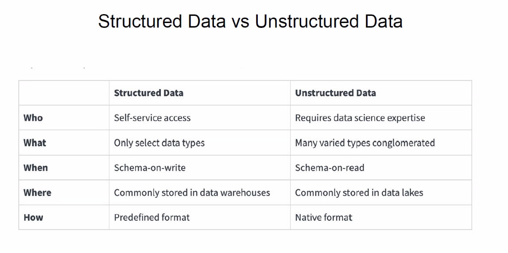

# dataScience-Lec1-16-FEb-25
Intro to Data Science

## definitions:
* Data science = a field that uses scientific methods, processes, algorithms,
and systems.
  * purpose: to extract knowledge and insights from structured and unstructured data.
* Structured/Unstructured=data can be structured (like schema)
  * schema= a SQL table or a collection of SQL tables

* Structured data:
  * before saving: need to decide and define how and what to save, need to create the schema before insert
  * referred to as schema -on-write
  * example: relational DB
  * pros:
    * easy used by machine learning algorithms
    * easy to understand and manage it, even for non-developer users
    * increased access to more tools, like reports
  * cons:
    * can insert only after predefined and created
    * limit the usage options, limit fields, only by template.
    * hard for changes
* unstructured data
  * example directory in python
  * saved as its origin format
  * known as schema-on-read
  * pros:
    * freedom of the native format: didn't change the data, allow to think and more usage
    * no option for losing information/data
    * faster accumulation
    * better pricing and scalability
  * cons:
    * required expertise for using the data
    * required tools for using the data, like extract from and analyze it. 

